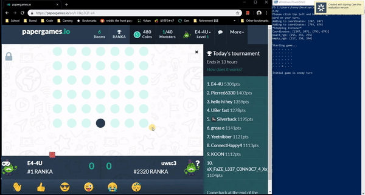
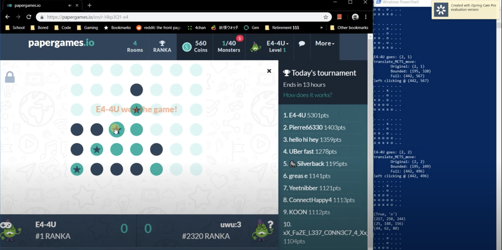

# E4-4U

E4-4U is a Python AI bot that autonomously plays Connect 4 games online for you.

Its decisions are based on a Monte Carlo Tree Search algorithm which simulates game outcomes based on your available moves and uses those outcomes to determine your next best move.

<h2>How this all works:</h2>

1. The user runs the program and is prompted to click on the upper left and bottom right corners of the game board when it is their first turn.

2. E4-4U takes a screenshot of the board (using pyscreenshot) based on those two input coordinates.

3. Then, it processes the screenshot into an initial game state.

<h4>The terminal window outputs:</h4>

Initial state:

. . . . . . .

. . . . . . .

. . . . . . .

. . . . . . .

. . . x . . . 

Initial game is enemy turn (enemy = 'X')

Now, that our initial state is set up,

4. Our bot determines your next best move based on its MCTS algorithm and performs it automatically (using pyautogui to take control of the mouse).

<h4>The terminal window outputs: "E4-4U goes: (3, 1)".</h4>

Your next best move is (3, 1) (4th column from the left, 2nd row from the bottom) and E4-4U automatically performs it.

5. Steps 2-4 are repeated until the game is over and you've won!

<h2>Full Demo:</h2>

https://youtu.be/iJY4uZ4lyKI

Bonus: If you notice in the video, our bot reached #1 spot on the daily tournament leaderboard :).
